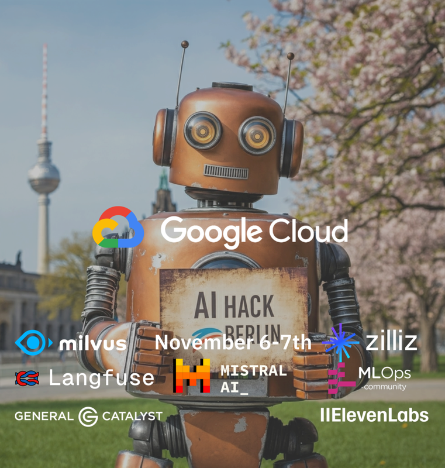

# EchoSight
### 🚀 Hackathon Project - [AI Hack 2024 Berlin](https://rsvp.withgoogle.com/events/ai-hack-berlin) 


Welcome to EchoSight! This project was born during AI Hack 2024.

Imagine an AI assistant designed to empower people with visual impairments, providing enhanced awareness of their surroundings. Whether it’s detecting obstacles in your path, notifying you of a letter or object on your desk, or offering real-time insights into an audience’s engagement—EchoSight is here to support you.

EchoSight bridges the information gap, aiming to help you interact confidently and effortlessly with the world around you.
It does this without spamming you and with minimal cloud calls.

## Architecture
EchoBrain's open prototype uses LLMs, OpenCV, lightweight local vision models and STT services.


## Dependencies and requirements
- needs `ffmpeg` to be installed
- set `Vertex AI User` and `AI Platform Admin` role to the service account 
- Also for vertexAI:
```
pip install --upgrade google-cloud-aiplatform
gcloud auth application-default login
 ```

## License
This project is licensed under the MIT License - see the LICENSE file for details.